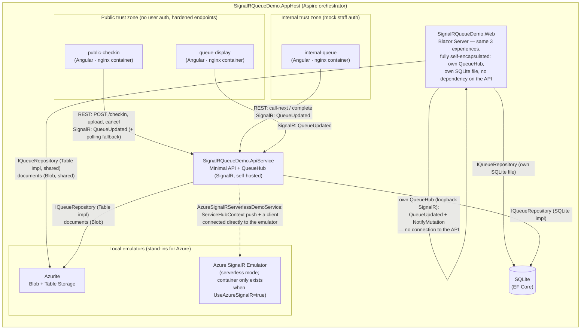
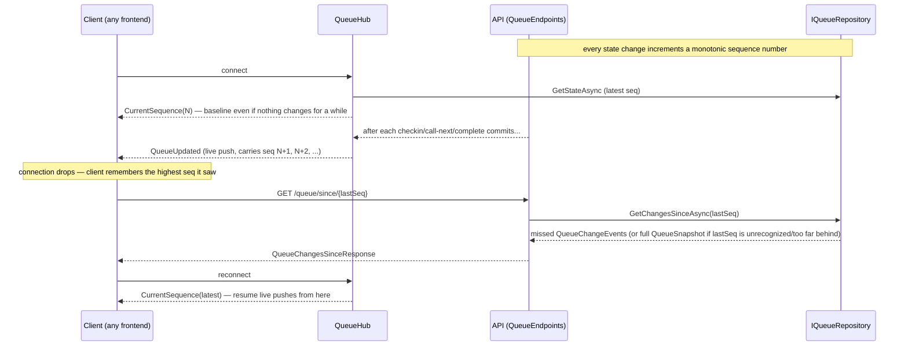

# Architecture

Living document for the DASH 2.0 walk-in queue POC. **Update this file (and `architecture.drawio`) in the same change as any code that adds/removes a resource, connection, or trust boundary.** The Mermaid diagrams below render directly on GitHub; `architecture.drawio` is the editable source for the exported `architecture.drawio.png` (see [Maintaining the diagrams](#maintaining-the-diagrams)).

## System overview

Everything runs locally under one .NET Aspire AppHost — no real Azure resources, emulators only (court constraint: no outbound cloud calls from the POC).

**Note on Blazor's client shape (originally #13; fully decoupled since #17):** `SignalRQueueDemo.Web` is
fully self-encapsulated — it has **no runtime dependency on `SignalRQueueDemo.ApiService`**.
Check-in/call-next/complete call directly into `SignalRQueueDemo.Shared`'s `IQueueRepository` (also referenced by
`ApiService`, no REST calls), and Blazor hosts its **own** `QueueHub` — the same hub class, moved to
`SignalRQueueDemo.Shared.Realtime` so both hosts share one implementation. `QueueRealtimeService` (the .NET twin
of the Angular shared library's `QueueHubService`) opens a loopback `HubConnection` to *that* hub — the app's own
base address (`NavigationManager.BaseUri` + `/hubs/queue`), never the API's — for live updates, and after a local
write invokes its own hub's `NotifyMutation` to fan the change out to the app's other Blazor circuits.
`NotifyMutation` **never trusts the caller's own claim about what changed**: it re-reads the actual entry/summary
from the repository before broadcasting, so a hostile caller on the hub (CORS doesn't gate non-browser callers at
all) can at most trigger a redundant broadcast of already-public data, never spoof state. See the
"self-encapsulate Blazor completely" and `NotifyMutation` trust-design entries in `docs/decisions.md`.

Two consequences worth knowing before touching this. **(1) The stacks are independent.** Because each hosts its
own hub in its own process, a broadcast on one never reaches the other's clients — a Blazor write does not
live-push to Angular, and vice versa. **(2) Storage is split by provider.** `SignalRQueueDemo.AppHost` points
`webfrontend` at its **own** SQLite file (`App_Data/queue.web.db`, an absolute path distinct from `apiservice`'s
`queue.db`), so under the default SQLite provider the two stacks are entirely separate stores (no shared data at
all); under the Table Storage provider they deliberately share the one Azurite emulator's tables/blobs — shared
infra, not a dependency on the API — so writes cross over via each stack's polling/catch-up but still never as a
live push. Blazor initializes its own storage at startup (it no longer waits for the API to seed first).

## Containerizing the Angular apps

Each of the three Angular apps builds and runs as its own Docker container, orchestrated by `SignalRQueueDemo.AppHost`:

- **Build:** one multi-stage `Dockerfile` (`SignalRQueueDemo.Angular/Dockerfile`), parameterized by an `APP_NAME` build arg — `node:22-slim` builds `shared` then the selected app (`ng build shared && ng build "$APP_NAME"`), discarded once built; `nginx:alpine` serves the result. The Docker build context is the whole `SignalRQueueDemo.Angular/` workspace folder (not a per-app subfolder), because every app's `tsconfig.json` resolves its `shared` import from `./dist/shared` — the workspace-root `package.json`/`angular.json` and the `shared` project must be in context regardless of which app is building.
- **Serve:** `docker/nginx.conf` serves the SPA (`try_files $uri $uri/ /index.html` for Angular client-side routing) and marks `config.json` `no-store` so a restarted container's fresh address is never masked by a browser-cached copy of the old one.
- **Runtime config, not build-time:** `docker/write-runtime-config.sh` runs as an nginx `/docker-entrypoint.d/` script at container *start*, overwriting `config.json` from the `API_BASE_URL` environment variable — the API's address is only known once Aspire assigns it at `aspire run` time, long after the image was built, so baking it in at `docker build` time would freeze in an address that doesn't exist yet and make the image usable in only one environment.
- **AppHost wiring:** `builder.AddDockerfile(name, "../SignalRQueueDemo.Angular", "Dockerfile").WithBuildArg("APP_NAME", ...)` declares each container resource; `WithEnvironment("API_BASE_URL", apiService.GetEndpoint("http", KnownNetworkIdentifiers.LocalhostNetwork))` injects the API's browser-reachable address (explicitly pinned to the localhost network context — see below for why that pin is load-bearing, not decorative); `WaitFor(apiService)` sequences container startup after the API is healthy. CORS is **not** wired from here — see the note after the trust-boundary table for why the API allows loopback origins directly instead.

**Why `KnownNetworkIdentifiers.LocalhostNetwork` is explicit, not the default `GetEndpoint(name)` call:** an endpoint reference with no network context resolves *relative to whichever resource consumes it*. Consumed by a container (all three Angular resources), the unqualified call resolves to Aspire's internal container-network tunnel address (`http://aspire.dev.internal:{port}`) — reachable from inside Aspire's Docker network, not from an actual browser. `API_BASE_URL` (read by browser JS) needs the one address a real browser on the host machine can reach, so `LocalhostNetwork` forces `http://localhost:{DCP-proxy-port}` — reachable, and the value baked into each container's `config.json` at start. (The same reasoning was originally applied to inject CORS origins too, but that was wrong for a subtle reason — see the trust-boundary note below.) A related trap the dated `docs/decisions.md` entry records: the resolved `http://localhost:{port}` is Aspire's own DCP proxy port, not the port `docker ps` shows for that container — the two differ, and only the DCP-proxy port is what every Aspire-aware reference (and a real browser) actually uses.

## Trust boundaries

| Zone | Apps | Auth | Notes |
|---|---|---|---|
| Public | `public-checkin`, `queue-display`, Blazor public pages | None (court visitors) | Lightweight hardening only, implemented in `ApiService`: a short-lived HMAC token (`GET /checkin/token`) gates the two state-changing check-in POSTs — `POST /checkin` via `CheckInTokenFilter`, the document upload inline before it buffers the body. Documented honestly — it raises the bar, it is not real security; see `README.md`'s Security model section for exactly what it does and doesn't protect against. |
| Internal | `internal-queue`, Blazor staff page | Mock auth (`X-Staff-Key` header, `StaffAuthFilter`; Blazor: `StaffKeyVerifier` checked in-process at sign-in, no REST round-trip) | Gates `POST /queue/call-next`, `POST /queue/{id}/complete`, and the two document-viewing endpoints. Blazor's document viewer additionally hosts its own local `GET /staff/documents/{entryId}/{docId}` endpoint (never a call to `ApiService`'s REST endpoint) gated by a short-lived per-document HMAC token instead of the header, since an `<iframe>`/`` `src` can't carry one — see `DocumentAccessTokenService`. Models the internal-vs-public boundary that production would enforce with Entra ID — the filter/verifier, not just the key, is what production replaces. |

Restricted CORS (policy `KnownFrontends`) is applied across **both** zones — every browser-reachable surface: the public and staff REST endpoints and the SignalR hub. It is not itself the trust boundary (the auth rows above are); it just keeps the legitimate cross-origin frontends — public *and* staff Angular apps, which all reach the hub for live updates — from being refused by the browser before those checks run, while an unlisted origin still is. The policy accepts two things: any origin listed explicitly in `Cors:AllowedOrigins`, **and** (when `Cors:AllowLoopbackOrigins` is `true`, the POC default) any loopback-family origin — `localhost`, `127.0.0.1`, `::1`, and any `*.localhost` host. That loopback allowance is what makes the containerized apps work: Aspire serves each one under a per-run `*.dev.localhost` hostname (e.g. `http://public-checkin-signalrqueuedemo.dev.localhost:{port}`) that no fixed allowlist can name ahead of time. An earlier attempt to inject those origins from `AppHost.cs` pinned the host to `localhost` and so silently failed CORS in a real browser (right port, wrong host); allowing the loopback family sidesteps Aspire's port/host churn entirely and is safe on this localhost-only, network-isolated machine. For any non-localhost deployment, set `Cors:AllowLoopbackOrigins=false` and list the real origins. See `docs/decisions.md`, the 2026-07-12 entry "CORS accepts any loopback-family origin".

## Reconnect / catch-up protocol

The core demo requirement: a client that disconnects must catch up on missed state, not just resume live pushes.
Implemented by `QueueHub` (self-hosted, mapped at `/hubs/queue`) plus `GET /queue/since/{sequenceNumber}`.

**Note on push ordering:** a broadcast only fires after its triggering write commits, so a client is always
guaranteed to see committed state when it calls `GET /queue/since/{seq}` right after a push. Broadcasts from
*concurrent* requests are not guaranteed to arrive in strict sequence-number order, though — clients must track
the highest sequence number seen, not just the most recently arrived message. See the XML docs on `QueueHub`
and the "Broadcasts happen at the REST endpoint layer" entry in `docs/decisions.md` for the full reasoning.

**Angular reference client (`SignalRQueueDemo.Angular/projects/shared/src/lib/services/queue-hub.service.ts`):** `QueueHubService`
implements this exact sequence — seeds state from `GET /queue`, connects with SignalR's `withAutomaticReconnect`,
tracks the highest sequence number seen (never overwritten, only `Math.max`'d, matching the push-ordering note
above), and calls `GET /queue/since/{seq}` in its `onreconnected` handler to replay whatever was missed. It also
falls back to polling `GET /queue` on an interval if the initial `HubConnection.start()` never succeeds (or the
socket is later given up on after exhausting automatic-reconnect) — SignalR's automatic reconnect only covers a
connection that dropped *after* connecting once, not an initial connection that never came up, so this fallback
covers the gap. All three Angular apps (`public-checkin`, `internal-queue`, `queue-display`) depend on this one
service instead of each opening their own `HubConnection` — see [`SignalRQueueDemo.Angular/README.md`](../SignalRQueueDemo.Angular/README.md).

**Blazor reference client (`SignalRQueueDemo.Web/Services/QueueRealtimeService.cs`):** the .NET twin of the
above — same state shape (snapshot, last update, connection state, the highest-sequence-seen tracking), same
polling fallback and reconnect-triggered catch-up. The one structural difference: Blazor has no REST client at
all, so catch-up and the polling fallback call `IQueueRepository` directly (the same in-process method
`ApiService`'s own REST handlers call) instead of an HTTP `GET`. See [Note on Blazor's client shape](#system-overview) above.

## Type mirroring (Angular)

`SignalRQueueDemo.Angular/projects/shared/src/lib/models/*.models.ts` hand-mirrors every `SignalRQueueDemo.Contracts` record as a
TypeScript interface — each interface's doc comment names the C# type it mirrors, and both sides are meant to be
updated together (see CLAUDE.md). Two wire-format details fall out of ASP.NET Core minimal APIs' default
(`JsonSerializerDefaults.Web`) `System.Text.Json` options, since `Program.cs` registers no naming policy or enum
converter override: JSON property names are camelCase (not the C# PascalCase), and enums serialize as their
numeric value, not their name — `QueueStatus` in `queue.models.ts` is declared with explicit numeric values
matching the C# enum's declaration order for exactly this reason. Hand-written mirroring (not OpenAPI/NSwag
generation) was chosen for this POC's size; see `docs/decisions.md` if that judgment call is ever revisited.

## Persistence

`IQueueRepository` abstracts storage — it lives in `SignalRQueueDemo.Shared` (not `ApiService`) so
`SignalRQueueDemo.Web` can call it directly too (see [Note on Blazor's client shape](#system-overview) above).
Two signature-compatible implementations, selected by `Persistence:Provider` config (`Sqlite` | `TableStorage`,
default `Sqlite`) — registered by `QueueServiceCollectionExtensions.AddQueueService()`, which both `ApiService`
and `Web`'s `Program.cs` call:

- **SQLite via EF Core** (`SqliteQueueRepository`) — default, zero setup.
- **Azure Table Storage via Azurite** (`TableStorageQueueRepository`) — demonstrates the cheaper Azure Storage path noted in ADR-0001 as "worth defaulting to on future low-complexity projects". `SignalRQueueDemo.AppHost` always starts the Azurite Table resource regardless of which provider is active, so flipping the config value is the entire migration — no other code change, no restart-time resource wiring to add.

Table Storage has no multi-row transactions and no server-side autoincrement, so it can't reuse SQLite's single-transaction "mutation + sequence number + consistent read-back" trick. Instead: the **monotonic sequence number** is allocated by inserting the change-event row itself (`AddEntity`, retry on `409` — the row's existence *is* the number), which keeps the change-event log gap-free and strictly in-order and lets catch-up hand a reconnecting client a baseline it can never over-run; the **check-in position** is an ETag-incremented `WaitingCount` counter that serializes concurrent check-ins into distinct positions; and **call-next/complete** use the same ETag `If-Match` pattern on the entry row to resolve races between concurrent staff actions. Both counter rows are reconciled to real state at startup (self-healing after any crash-window drift). See `TableStorageQueueRepository`'s XML docs and `docs/decisions.md` for the full design — verified against a live Azurite emulator (direct and over HTTP): gap-free log and no catch-up baseline ahead of its diff under 20 concurrent check-ins interleaved with catch-up reads, distinct positions under concurrent check-ins, no double-serve under concurrent call-next.

Uploaded documents go to Blob Storage (Azurite locally) via `DocumentBlobStore`, one container per queue entry (`docs-{entryId}`, created lazily on first upload), always under a randomized (`Guid`) blob name — never the client-supplied filename, which is a path-traversal/collision vector on a public endpoint. Metadata (display filename, content type, size, uploaded-at) is tracked separately through a new `IDocumentRepository`, backed by the same store as `IQueueRepository` for the active `Persistence:Provider` (SQLite: a `Documents` table sharing `QueueDbContext`'s connection; Table Storage: a `QueueDocuments` table partitioned by entry id) — so the staff console lists a visitor's documents with one local read, never a live Blob container enumeration. See `docs/decisions.md` for the container-per-entry, randomized-naming, and blob-before-metadata-write rationale, and for why the content-type allowlist checks the client's `Content-Type` header rather than sniffing file bytes.

The two staff-facing document endpoints (`GET /queue/{id}/documents`, `GET /queue/{id}/documents/{docId}`) sit behind the mock staff-auth `X-Staff-Key` filter (`StaffAuthFilter`), alongside call-next/complete — see [Trust boundaries](#trust-boundaries) above and `README.md`'s Security model section.

**Document lifetime.** Blob content shares the metadata's across-restart lifetime — the Azurite emulator runs with a data volume (`WithDataVolume`) so a document uploaded in one `aspire run` is still viewable in the next, rather than leaving a metadata row pointing at a blob the emulator dropped. When an entry is **completed**, its documents are deleted outright (metadata rows first, then the blob container — a partial failure can then only orphan a harmless blob, never dangle metadata); the cleanup is best-effort and off the response path. So content exists exactly while the visitor is in the queue. Each entry also carries a `DocumentCount` on the live snapshot (counted once per snapshot build, not a denormalized column) so the staff console can hide its "view documents" control when there's nothing attached; both a document upload and a completion's document deletion broadcast a fresh snapshot afterward (via `IQueueRepository.RecordDocumentChangeAsync`, which appends a change event so the sequence-numbered protocol stays intact), so the count updates live in both directions instead of staying stale at its last pre-deletion value once completed. Catch-up-replayed entries still carry `DocumentCount = 0` (the change-event log doesn't persist it) and self-heal on the next full snapshot — see `QueueEntry.DocumentCount`'s XML docs and `docs/decisions.md` (2026-07-12) for why that narrow, self-closing gap is accepted rather than fixed. In `TableStorageQueueRepository`, the per-entry count is queried scoped to the snapshot's own entries (one partition-scoped query per entry, in parallel) rather than scanning the whole `QueueDocuments` table, so its cost tracks queue size, not total documents ever uploaded — see the same decisions entry.

## Public display: masked names + check-in QR

The `queue-display` board shows each entry's ticket number **and** the visitor's name masked to first-name-plus-last-initial (`toPublicName`, e.g. "Jane T.") — enough to recognise your own row without publishing full surnames to the whole room. Full names appear only on the `internal-queue` staff console, which is behind the staff-auth boundary. (This is a deliberate relaxation of the board's original ticket-only rule — see the 2026-07-12 decisions entry.) The board also renders a "check in from your phone" QR code + URL. The two frontend stacks point their QR at different apps, reflecting their different architectures:

- **Angular `queue-display`** advertises the **public-checkin Angular app** (a separate app it can't share code with). The board fetches **both** the plain URL (`GET /checkin/url`) and the QR image (`GET /checkin/qr`) from the API, which is the single source of the public-checkin address — the AppHost injects that address (`LocalhostNetwork`-pinned) into the API alone as `PublicCheckinUrl`. The QR is encoded **server-side** by the shared `QrCodeHelper.GenerateSvg`; the board just points an `` at the endpoint, so it carries no client-side QR library and its `config.json` needs only `apiBaseUrl` (identical to the other two containers — nothing about the check-in app is injected into it).
- **Blazor `/display`** advertises the **Blazor app's own `/checkin` page** (derived from `NavigationManager.BaseUri`), calling `QrCodeHelper` directly in-process. It never references the API or the Angular apps — consistent with "Blazor is self-encapsulated".

`QrCodeHelper` lives in `SignalRQueueDemo.Shared` for exactly this reason: one encoder reused by both the API (serving the Angular apps) and Blazor, with no duplicated code and no QR generation left on any front-end. In either case the SVG is generated on the isolated machine, never fetched from a QR web service (the no-external-calls constraint, and it would leak the URL off-machine). In the POC these URLs are localhost addresses, so the QR illustrates the pattern rather than being phone-scannable from another network.

## Azure SignalR escape hatch (ADR-0001, Option C chosen)

Self-hosted SignalR is the accepted decision, and it's what every frontend (Angular and Blazor) talks to regardless of the `UseAzureSignalR` flag — the flag never reroutes real app traffic. It exists to show the vendor team the two paths ADR-0001 names, both against the local Azure SignalR **Emulator**, never a real Azure resource:

- **Default/server mode** (`AzureSignalRDefaultModeStub.Apply`) — the actual one-line production change (`AddAzureSignalR(connectionString)`). Never invoked: the emulator only supports serverless mode, so there's no local target this call could point at without a real Azure SignalR resource.
- **Serverless mode** (`AzureSignalRServerlessDemoService`) — the path the emulator *can* run. A hosted service, registered only when the flag is on, that builds a `ServiceHubContext` (`Microsoft.Azure.SignalR.Management`), connects a client straight to the emulator (serverless clients bypass ASP.NET Core hubs entirely), and pushes one synthetic `QueueUpdated` through it to prove the round-trip. Runs once at startup, logs success/timeout, and never throws past itself — a broken emulator container can't take down the API.

`AppHost.cs` reads its own copy of `UseAzureSignalR` to decide whether the `signalr` emulator resource (`AddAzureSignalR("signalr", AzureSignalRServiceMode.Serverless).RunAsEmulator()`) exists at all — unlike the storage emulator, which always runs, this one only starts a container when someone has opted in. **Verified quirk:** Azure SignalR hub names reject hyphens (`negotiate` accepts one, the send REST call 400s) — `AzureSignalRServerlessDemoService.DemoHubName` is camelCase for exactly this reason. See `README.md`'s "Scaling past self-hosted" section for how to flip the flag and what to expect in the logs.

## Maintaining the diagrams

- **Mermaid (this file)** is the source of truth developers see on GitHub — keep it current first.
- **`architecture.drawio`** is the editable rich diagram. Edit it with the [VS Code Draw.io Integration extension](https://marketplace.visualstudio.com/items?itemName=hediet.vscode-drawio) or [app.diagrams.net](https://app.diagrams.net).
- **`architecture.drawio.png`** — export from the `.drawio` file so the diagram is viewable as a plain image. Easiest workflow: in the VS Code extension, *File → Save As → `architecture.drawio.png`* once; from then on you can edit the `.png` directly (draw.io embeds the diagram XML inside the PNG, so it stays editable AND viewable on GitHub).
- Optional automation: the [`rlespinasse/drawio-export-action`](https://github.com/rlespinasse/drawio-export-action) GitHub Action can regenerate PNGs from `.drawio` files on every push if manual exports become a chore.
