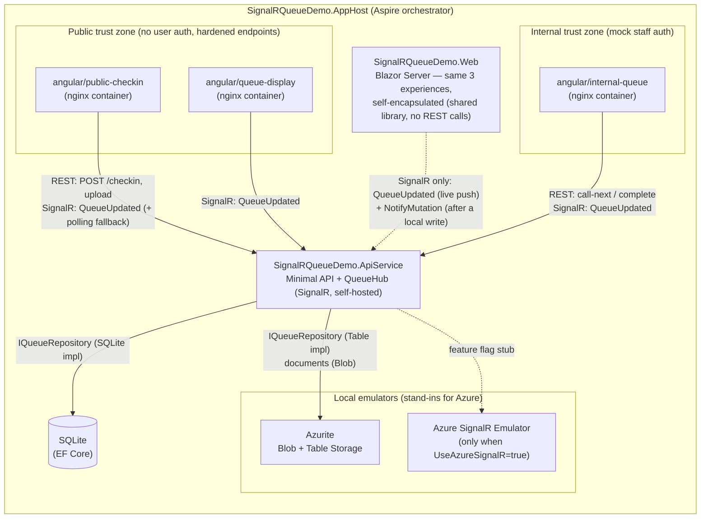
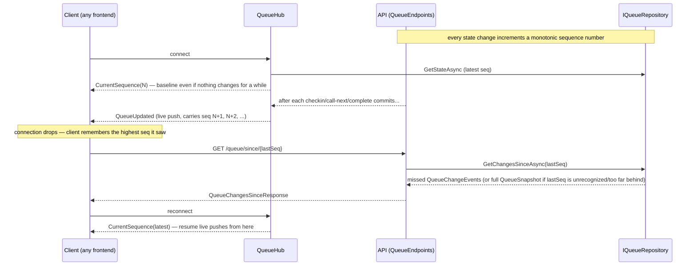

# Architecture

Living document for the DASH 2.0 walk-in queue POC. **Update this file (and `architecture.drawio`) in the same change as any code that adds/removes a resource, connection, or trust boundary.** The Mermaid diagrams below render directly on GitHub; `architecture.drawio` is the editable source for the exported `architecture.drawio.png` (see [Maintaining the diagrams](#maintaining-the-diagrams)).

## System overview

Everything runs locally under one .NET Aspire AppHost — no real Azure resources, emulators only (court constraint: no outbound cloud calls from the POC).

**Note on Blazor's client shape:** `SignalRQueueDemo.Web` is self-encapsulated — check-in/call-next/complete call
directly into a shared queue-service library also referenced by `SignalRQueueDemo.ApiService` (no REST calls to
the API). Blazor and `ApiService` still run as separate Aspire process resources, so Blazor can't reach
`QueueHub`'s broadcast the way `QueueEndpoints` does; it closes that gap by reusing the SignalR `HubConnection`
it already holds for live updates — after a local mutation, it invokes a hub method that tells `QueueHub` to
broadcast, so every other client (Angular, other Blazor sessions) still sees the change. See "Blazor is
self-encapsulated" in `docs/decisions.md` for the full reasoning.

## Trust boundaries

| Zone | Apps | Auth | Notes |
|---|---|---|---|
| Public | `public-checkin`, `queue-display`, Blazor public pages | None (court visitors) | Lightweight hardening only: restricted CORS + anti-forgery/API-key pattern. Documented honestly — it raises the bar, it is not real security. |
| Internal | `internal-queue`, Blazor staff page | Mock auth (simple header/key) | Models the internal-vs-public boundary that production would enforce with Entra ID. |

## Reconnect / catch-up protocol

The core demo requirement: a client that disconnects must catch up on missed state, not just resume live pushes.
Implemented in issue #3: `QueueHub` (self-hosted, mapped at `/hubs/queue`) plus `GET /queue/since/{sequenceNumber}`.

**Note on push ordering:** a broadcast only fires after its triggering write commits, so a client is always
guaranteed to see committed state when it calls `GET /queue/since/{seq}` right after a push. Broadcasts from
*concurrent* requests are not guaranteed to arrive in strict sequence-number order, though — clients must track
the highest sequence number seen, not just the most recently arrived message. See the XML docs on `QueueHub`
and the "Broadcasts happen at the REST endpoint layer" entry in `docs/decisions.md` for the full reasoning.

## Persistence

`IQueueRepository` abstracts storage. Two signature-compatible implementations, selected by `Persistence:Provider` config (`Sqlite` | `TableStorage`, default `Sqlite`) — see `Program.cs`:

- **SQLite via EF Core** (`SqliteQueueRepository`) — default, zero setup.
- **Azure Table Storage via Azurite** (`TableStorageQueueRepository`, issue #4) — demonstrates the cheaper Azure Storage path noted in ADR-0001 as "worth defaulting to on future low-complexity projects". `SignalRQueueDemo.AppHost` always starts the Azurite Table resource regardless of which provider is active, so flipping the config value is the entire migration — no other code change, no restart-time resource wiring to add.

Table Storage has no multi-row transactions and no server-side autoincrement, so it can't reuse SQLite's single-transaction "mutation + sequence number + consistent read-back" trick. Instead: the **monotonic sequence number** is allocated by inserting the change-event row itself (`AddEntity`, retry on `409` — the row's existence *is* the number), which keeps the change-event log gap-free and strictly in-order and lets catch-up hand a reconnecting client a baseline it can never over-run; the **check-in position** is an ETag-incremented `WaitingCount` counter that serializes concurrent check-ins into distinct positions; and **call-next/complete** use the same ETag `If-Match` pattern on the entry row to resolve races between concurrent staff actions. Both counter rows are reconciled to real state at startup (self-healing after any crash-window drift). See `TableStorageQueueRepository`'s XML docs and `docs/decisions.md` for the full design — verified against a live Azurite emulator (direct and over HTTP): gap-free log and no catch-up baseline ahead of its diff under 20 concurrent check-ins interleaved with catch-up reads, distinct positions under concurrent check-ins, no double-serve under concurrent call-next.

Uploaded documents go to Blob Storage (Azurite locally).

## Azure SignalR stub (ADR-0001, Option C chosen)

Self-hosted SignalR is the accepted decision. The `UseAzureSignalR` config flag (default `false`) shows the one-line escape hatch (`AddAzureSignalR(...)`) and, when enabled, targets the local Azure SignalR **Emulator** — never a real Azure resource. Known limitation: the emulator only supports serverless mode, so the stub is primarily illustrative; this is documented at the call site.

## Maintaining the diagrams

- **Mermaid (this file)** is the source of truth developers see on GitHub — keep it current first.
- **`architecture.drawio`** is the editable rich diagram. Edit it with the [VS Code Draw.io Integration extension](https://marketplace.visualstudio.com/items?itemName=hediet.vscode-drawio) or [app.diagrams.net](https://app.diagrams.net).
- **`architecture.drawio.png`** — export from the `.drawio` file so the diagram is viewable as a plain image. Easiest workflow: in the VS Code extension, *File → Save As → `architecture.drawio.png`* once; from then on you can edit the `.png` directly (draw.io embeds the diagram XML inside the PNG, so it stays editable AND viewable on GitHub).
- Optional automation: the [`rlespinasse/drawio-export-action`](https://github.com/rlespinasse/drawio-export-action) GitHub Action can regenerate PNGs from `.drawio` files on every push if manual exports become a chore.
