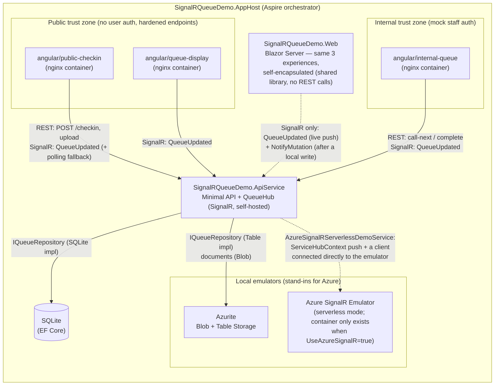
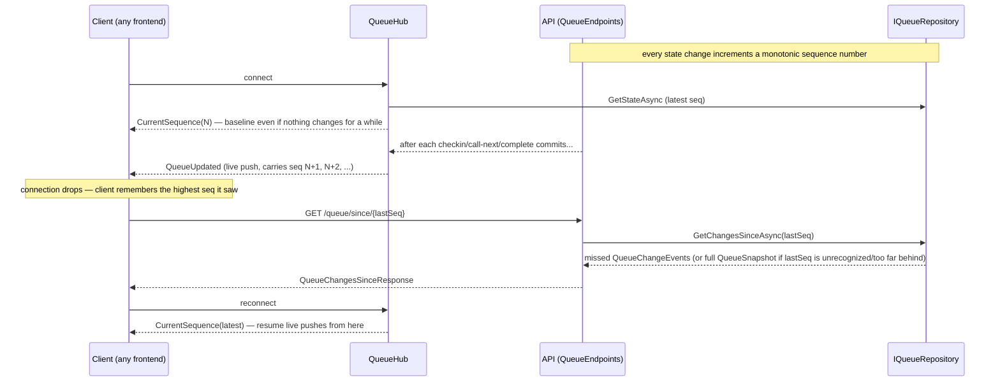

# Architecture

Living document for the DASH 2.0 walk-in queue POC. **Update this file (and `architecture.drawio`) in the same change as any code that adds/removes a resource, connection, or trust boundary.** The Mermaid diagrams below render directly on GitHub; `architecture.drawio` is the editable source for the exported `architecture.drawio.png` (see [Maintaining the diagrams](#maintaining-the-diagrams)).

## System overview

Everything runs locally under one .NET Aspire AppHost — no real Azure resources, emulators only (court constraint: no outbound cloud calls from the POC).

**Note on Blazor's client shape:** `SignalRQueueDemo.Web` is self-encapsulated — check-in/call-next/complete call
directly into a shared queue-service library also referenced by `SignalRQueueDemo.ApiService` (no REST calls to
the API). Blazor and `ApiService` still run as separate Aspire process resources, so Blazor can't reach
`QueueHub`'s broadcast the way `QueueEndpoints` does; it closes that gap by reusing the SignalR `HubConnection`
it already holds for live updates — after a local mutation, it invokes a hub method that tells `QueueHub` to
broadcast, so every other client (Angular, other Blazor sessions) still sees the change. See "Blazor is
self-encapsulated" in `docs/decisions.md` for the full reasoning.

## Trust boundaries

| Zone | Apps | Auth | Notes |
|---|---|---|---|
| Public | `public-checkin`, `queue-display`, Blazor public pages | None (court visitors) | Lightweight hardening only, implemented in `ApiService`: a short-lived HMAC token (`GET /checkin/token`) gates the two state-changing check-in POSTs — `POST /checkin` via `CheckInTokenFilter`, the document upload inline before it buffers the body. Documented honestly — it raises the bar, it is not real security; see `README.md`'s Security model section for exactly what it does and doesn't protect against. |
| Internal | `internal-queue`, Blazor staff page | Mock auth (`X-Staff-Key` header, `StaffAuthFilter`) | Gates `POST /queue/call-next`, `POST /queue/{id}/complete`, and the two document-viewing endpoints. Models the internal-vs-public boundary that production would enforce with Entra ID — the filter, not just its key, is what production replaces. |

Restricted CORS (`Cors:AllowedOrigins`, policy `KnownFrontends`) is applied across **both** zones — every browser-reachable surface: the public and staff REST endpoints and the SignalR hub. It is not itself the trust boundary (the auth rows above are); it just keeps the legitimate cross-origin frontends — public *and* staff Angular apps, which all reach the hub for live updates — from being refused by the browser before those checks run, while an unlisted origin still is. See `docs/decisions.md`, "CORS allowed origins are config".

## Reconnect / catch-up protocol

The core demo requirement: a client that disconnects must catch up on missed state, not just resume live pushes.
Implemented by `QueueHub` (self-hosted, mapped at `/hubs/queue`) plus `GET /queue/since/{sequenceNumber}`.

**Note on push ordering:** a broadcast only fires after its triggering write commits, so a client is always
guaranteed to see committed state when it calls `GET /queue/since/{seq}` right after a push. Broadcasts from
*concurrent* requests are not guaranteed to arrive in strict sequence-number order, though — clients must track
the highest sequence number seen, not just the most recently arrived message. See the XML docs on `QueueHub`
and the "Broadcasts happen at the REST endpoint layer" entry in `docs/decisions.md` for the full reasoning.

## Persistence

`IQueueRepository` abstracts storage. Two signature-compatible implementations, selected by `Persistence:Provider` config (`Sqlite` | `TableStorage`, default `Sqlite`) — see `Program.cs`:

- **SQLite via EF Core** (`SqliteQueueRepository`) — default, zero setup.
- **Azure Table Storage via Azurite** (`TableStorageQueueRepository`) — demonstrates the cheaper Azure Storage path noted in ADR-0001 as "worth defaulting to on future low-complexity projects". `SignalRQueueDemo.AppHost` always starts the Azurite Table resource regardless of which provider is active, so flipping the config value is the entire migration — no other code change, no restart-time resource wiring to add.

Table Storage has no multi-row transactions and no server-side autoincrement, so it can't reuse SQLite's single-transaction "mutation + sequence number + consistent read-back" trick. Instead: the **monotonic sequence number** is allocated by inserting the change-event row itself (`AddEntity`, retry on `409` — the row's existence *is* the number), which keeps the change-event log gap-free and strictly in-order and lets catch-up hand a reconnecting client a baseline it can never over-run; the **check-in position** is an ETag-incremented `WaitingCount` counter that serializes concurrent check-ins into distinct positions; and **call-next/complete** use the same ETag `If-Match` pattern on the entry row to resolve races between concurrent staff actions. Both counter rows are reconciled to real state at startup (self-healing after any crash-window drift). See `TableStorageQueueRepository`'s XML docs and `docs/decisions.md` for the full design — verified against a live Azurite emulator (direct and over HTTP): gap-free log and no catch-up baseline ahead of its diff under 20 concurrent check-ins interleaved with catch-up reads, distinct positions under concurrent check-ins, no double-serve under concurrent call-next.

Uploaded documents go to Blob Storage (Azurite locally) via `DocumentBlobStore`, one container per queue entry (`docs-{entryId}`, created lazily on first upload), always under a randomized (`Guid`) blob name — never the client-supplied filename, which is a path-traversal/collision vector on a public endpoint. Metadata (display filename, content type, size, uploaded-at) is tracked separately through a new `IDocumentRepository`, backed by the same store as `IQueueRepository` for the active `Persistence:Provider` (SQLite: a `Documents` table sharing `QueueDbContext`'s connection; Table Storage: a `QueueDocuments` table partitioned by entry id) — so the staff console lists a visitor's documents with one local read, never a live Blob container enumeration. See `docs/decisions.md` for the container-per-entry, randomized-naming, and blob-before-metadata-write rationale, and for why the content-type allowlist checks the client's `Content-Type` header rather than sniffing file bytes.

The two staff-facing document endpoints (`GET /queue/{id}/documents`, `GET /queue/{id}/documents/{docId}`) sit behind the mock staff-auth `X-Staff-Key` filter (`StaffAuthFilter`), alongside call-next/complete — see [Trust boundaries](#trust-boundaries) above and `README.md`'s Security model section.

## Azure SignalR escape hatch (ADR-0001, Option C chosen)

Self-hosted SignalR is the accepted decision, and it's what every frontend (Angular and Blazor) talks to regardless of the `UseAzureSignalR` flag — the flag never reroutes real app traffic. It exists to show the vendor team the two paths ADR-0001 names, both against the local Azure SignalR **Emulator**, never a real Azure resource:

- **Default/server mode** (`AzureSignalRDefaultModeStub.Apply`) — the actual one-line production change (`AddAzureSignalR(connectionString)`). Never invoked: the emulator only supports serverless mode, so there's no local target this call could point at without a real Azure SignalR resource.
- **Serverless mode** (`AzureSignalRServerlessDemoService`) — the path the emulator *can* run. A hosted service, registered only when the flag is on, that builds a `ServiceHubContext` (`Microsoft.Azure.SignalR.Management`), connects a client straight to the emulator (serverless clients bypass ASP.NET Core hubs entirely), and pushes one synthetic `QueueUpdated` through it to prove the round-trip. Runs once at startup, logs success/timeout, and never throws past itself — a broken emulator container can't take down the API.

`AppHost.cs` reads its own copy of `UseAzureSignalR` to decide whether the `signalr` emulator resource (`AddAzureSignalR("signalr", AzureSignalRServiceMode.Serverless).RunAsEmulator()`) exists at all — unlike the storage emulator, which always runs, this one only starts a container when someone has opted in. **Verified quirk:** Azure SignalR hub names reject hyphens (`negotiate` accepts one, the send REST call 400s) — `AzureSignalRServerlessDemoService.DemoHubName` is camelCase for exactly this reason. See `README.md`'s "Scaling past self-hosted" section for how to flip the flag and what to expect in the logs.

## Maintaining the diagrams

- **Mermaid (this file)** is the source of truth developers see on GitHub — keep it current first.
- **`architecture.drawio`** is the editable rich diagram. Edit it with the [VS Code Draw.io Integration extension](https://marketplace.visualstudio.com/items?itemName=hediet.vscode-drawio) or [app.diagrams.net](https://app.diagrams.net).
- **`architecture.drawio.png`** — export from the `.drawio` file so the diagram is viewable as a plain image. Easiest workflow: in the VS Code extension, *File → Save As → `architecture.drawio.png`* once; from then on you can edit the `.png` directly (draw.io embeds the diagram XML inside the PNG, so it stays editable AND viewable on GitHub).
- Optional automation: the [`rlespinasse/drawio-export-action`](https://github.com/rlespinasse/drawio-export-action) GitHub Action can regenerate PNGs from `.drawio` files on every push if manual exports become a chore.
