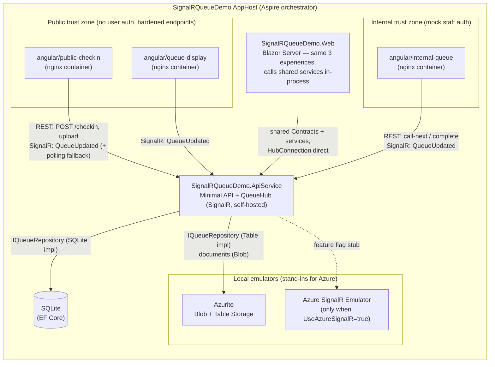
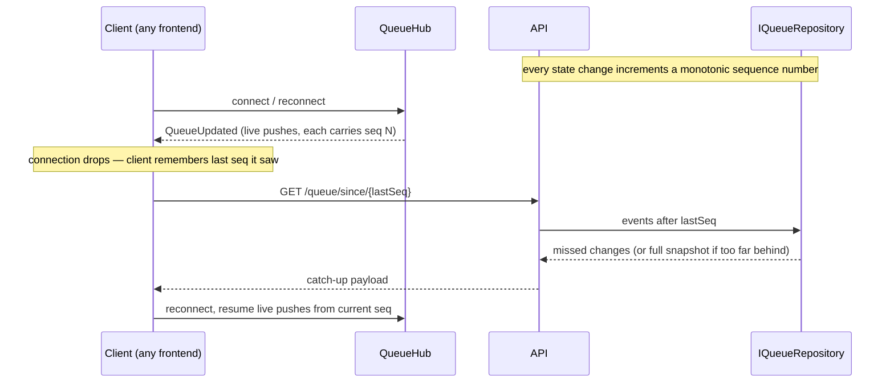

# Architecture

Living document for the DASH 2.0 walk-in queue POC. **Update this file (and `architecture.drawio`) in the same change as any code that adds/removes a resource, connection, or trust boundary.** The Mermaid diagrams below render directly on GitHub; `architecture.drawio` is the editable source for the exported `architecture.drawio.png` (see [Maintaining the diagrams](#maintaining-the-diagrams)).

## System overview

Everything runs locally under one .NET Aspire AppHost — no real Azure resources, emulators only (court constraint: no outbound cloud calls from the POC).

## Trust boundaries

| Zone | Apps | Auth | Notes |
|---|---|---|---|
| Public | `public-checkin`, `queue-display`, Blazor public pages | None (court visitors) | Lightweight hardening only: restricted CORS + anti-forgery/API-key pattern. Documented honestly — it raises the bar, it is not real security. |
| Internal | `internal-queue`, Blazor staff page | Mock auth (simple header/key) | Models the internal-vs-public boundary that production would enforce with Entra ID. |

## Reconnect / catch-up protocol

The core demo requirement: a client that disconnects must catch up on missed state, not just resume live pushes.

## Persistence

`IQueueRepository` abstracts storage. Two signature-compatible implementations, selected by config:

- **SQLite via EF Core** — default, zero setup.
- **Azure Table Storage via Azurite** — demonstrates the cheaper Azure Storage path noted in ADR-0001 as "worth defaulting to on future low-complexity projects".

Uploaded documents go to Blob Storage (Azurite locally).

## Azure SignalR stub (ADR-0001, Option C chosen)

Self-hosted SignalR is the accepted decision. The `UseAzureSignalR` config flag (default `false`) shows the one-line escape hatch (`AddAzureSignalR(...)`) and, when enabled, targets the local Azure SignalR **Emulator** — never a real Azure resource. Known limitation: the emulator only supports serverless mode, so the stub is primarily illustrative; this is documented at the call site.

## Maintaining the diagrams

- **Mermaid (this file)** is the source of truth developers see on GitHub — keep it current first.
- **`architecture.drawio`** is the editable rich diagram. Edit it with the [VS Code Draw.io Integration extension](https://marketplace.visualstudio.com/items?itemName=hediet.vscode-drawio) or [app.diagrams.net](https://app.diagrams.net).
- **`architecture.drawio.png`** — export from the `.drawio` file so the diagram is viewable as a plain image. Easiest workflow: in the VS Code extension, *File → Save As → `architecture.drawio.png`* once; from then on you can edit the `.png` directly (draw.io embeds the diagram XML inside the PNG, so it stays editable AND viewable on GitHub).
- Optional automation: the [`rlespinasse/drawio-export-action`](https://github.com/rlespinasse/drawio-export-action) GitHub Action can regenerate PNGs from `.drawio` files on every push if manual exports become a chore.
